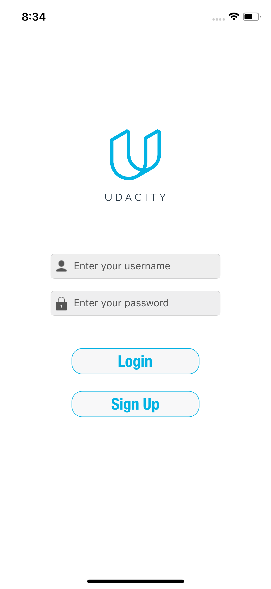
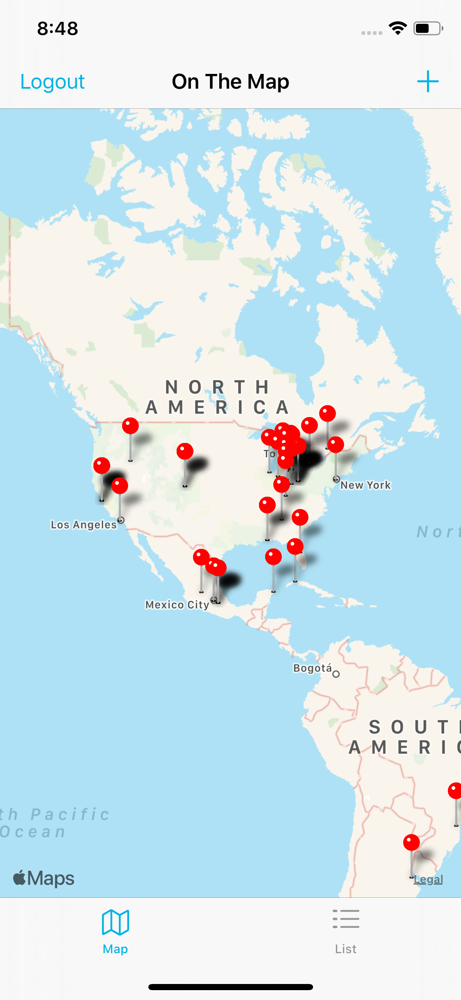
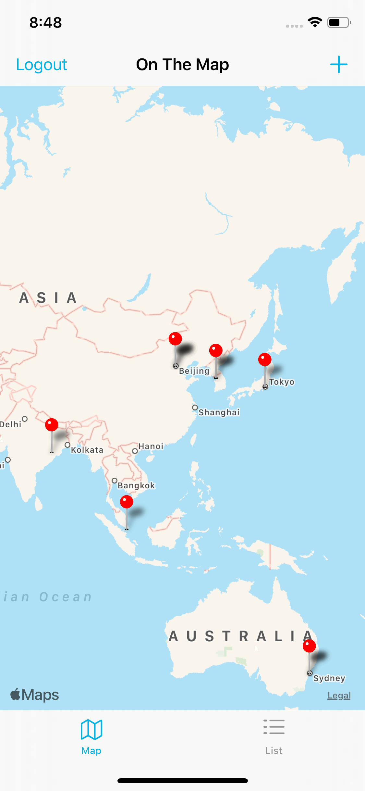
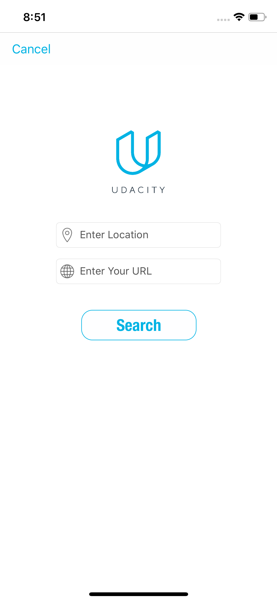
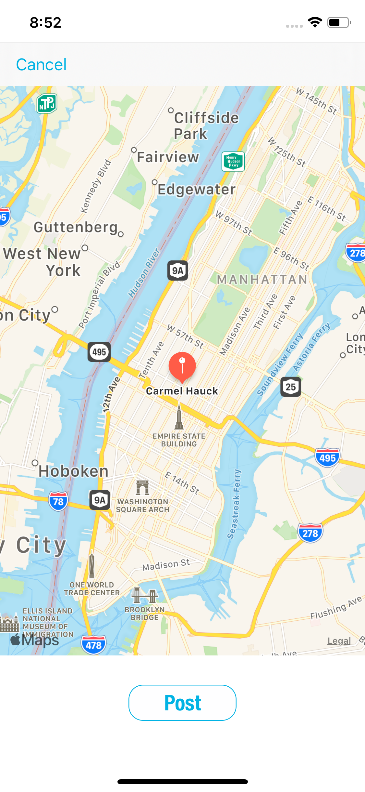

# On-the-map
IOS Application for Udacity. "On the Map" project

## Description

### Login
This Login View allows the user to login and gain access to the other views in the application.

### Map

The map displays users' annotations.

   

### Adding new annotations

Adding new annotations is very simple. You just have to enter your location and URL. After that, the app will geocode to the location you have provided.

   
